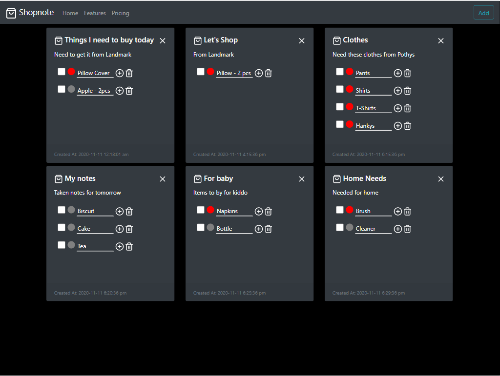

<h1 align="center">
  Jamstack Shopnote
</h1>

`shopnote` is a JAMstack application helps in creating notes with shopping items. This application is built to showcase the JAMstack concept using `Fauna`, `Netlify Serverless Functions` and `GatsbyJS`. This is a sample application and should be used only for the learning purpose.

# Many Thanks to all the `Stargazers` who has supported this project with stars(⭐)

[](https://github.com/atapas/shopnote/stargazers)

<p align="center">
  <a href="https://shopnote.netlify.app/">
    
  </a>
</p>

# How to run

This project uses `Fauna` as the data store. Plesae make sure to create an account with [Fauna](https://fauna.com/). Clone this project and follw these steps.

- Create a database in Fauna called, `shopnotes`.
- Upload the [shopnotes.gql](https://github.com/atapas/shopnote/blob/main/shopnotes.gql) file to the database created.
- Create the server secret key.
- Clone the project.
- Chage directory to the project locally(cd shopnote).
- Install `netlify-cli` globally,
 ```shell
 npm install -g netlify-cli
 ```
- Install dependencies,
 ```shell
 yarn install
 ```
- Create a file called `.env` at the root of the project and copy-paste the Fauna Server key as,
 ```shell
 FAUNA_SERVER_SECRET=YOUR_SECRET_KEY
 ```
- Run the commands
 ```shell
 netlify login
 
 netlify dev
 ```
 
You should have the application launched @ http://localhost:8888

# Build Status
[](https://app.netlify.com/sites/shopnote/deploys)

# Step-by-step approach
[A Step by Step guide](https://css-tricks.com/how-to-create-a-client-serverless-jamstack-app-using-netlify-gatsby-and-fauna/) to build `shopnote` like application.

# Important Links
- [Netlify Functions](https://www.netlify.com/products/functions/)
- [Fauna GraphQL relations](https://docs.fauna.com/fauna/current/api/graphql/relations)
- [GatsbyJS](http://gatsbyjs.org/)
